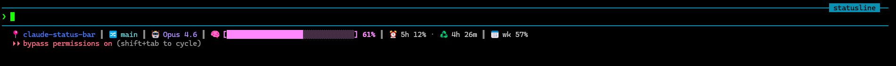

# claude-modern-status-bar

A native C status line for [Claude Code](https://docs.claude.com/en/docs/claude-code) on Windows. Single ~430-line source file, compiles to a ~160 KB self-contained `.exe`, renders in **~21 ms** per invocation — roughly **70× faster** than the bash + python + git + awk pipeline most people start with.



## What you get

```
folder  |  branch  |  model  |  [bar] 47%  |  5h 23% · 4h 26m  |  wk 41%
```

- **Folder** — basename of the current working directory (bold blue)
- **Branch** — current git branch, or short SHA if detached HEAD (cyan)
- **Model** — the active Claude model from Claude Code's input JSON (purple)
- **Context bar** — 30-char bar showing **free space remaining** before auto-compact, with the matching percentage (bold pink)
- **5-hour usage** — the same percentage `/usage` shows for the rolling 5-hour limit, plus the time until it resets. White under 70%, yellow at 70–89%, red at 90%+. Reset countdown formats as `47m` / `3h` / `1h 47m` / `<1m`. Omitted entirely if Claude Code doesn't pipe in the `rate_limits.five_hour` field; the countdown half is omitted independently if `resets_at` is missing or already in the past.
- **Weekly usage** — same as above for the rolling 7-day limit, without the countdown. Same color thresholds.
- **Separator** — gray vertical bar between segments

The context bar shows *free* space (not used), to match what Claude Code's `/context` command labels "Free space". The math accounts for the ~33 k-token autocompact buffer Claude Code reserves before auto-compaction fires — 16.5% on a 200 k window, 3.3% on a 1 M extended-context window. The reserve is computed from the `context_window_size` Claude Code reports, so it stays correct on any window size.

## Why this exists

Claude Code lets you set a custom command as your status line. The default approach in most community examples is a bash script that pipes through `jq`, calls `git`, and shells out to `awk` or `python`. On Windows, every one of those is a fork through Git Bash, and the cumulative cost is **~1.5 seconds per render**. That's perceptible keystroke lag, every time you type.

This project replaces all of that with one ~430-line C file that:

- parses just the JSON fields it needs (no `jq`)
- reads `.git/HEAD` directly (no `git` fork)
- statically links the C runtime (no DLL load)
- writes UTF-8 + ANSI colors straight to stdout

The result is **~21 ms per render**, well under the ~30 ms ceiling where keystroke lag becomes noticeable.

## Requirements

- **Windows 10 or 11**
- **[Windows Terminal](https://aka.ms/terminal)** (or any modern terminal that handles UTF-8 + ANSI 256-color). The legacy `cmd.exe` console will render boxes instead of emojis.
- **[Claude Code](https://docs.claude.com/en/docs/claude-code) 2.0+**
- **MSVC 2022 Community** — *only if building from source*. For binary installs, skip this.

## Install — binary (recommended)

1. Download `statusline.exe` from the [latest Release](https://github.com/ShayanNasiri/claude-modern-status-bar/releases/latest).
2. Drop it at `%USERPROFILE%\.claude\statusline.exe`.
3. Open `%USERPROFILE%\.claude\settings.json` and add the `statusLine` key. Replace `<your-username>` with your actual Windows username — forward slashes are fine, Claude Code accepts them.

   **If `settings.json` does not exist yet**, create it with exactly this content:

   ```json
   {
     "statusLine": {
       "type": "command",
       "command": "C:/Users/<your-username>/.claude/statusline.exe"
     }
   }
   ```

   **If `settings.json` already exists**, do not overwrite it — merge the `statusLine` key into the existing object alongside whatever is already there. For example, if your file currently looks like:

   ```json
   {
     "theme": "dark",
     "permissions": { "allow": ["Bash(git status)"] }
   }
   ```

   it should become:

   ```json
   {
     "theme": "dark",
     "permissions": { "allow": ["Bash(git status)"] },
     "statusLine": {
       "type": "command",
       "command": "C:/Users/<your-username>/.claude/statusline.exe"
     }
   }
   ```

   Mind the comma after the previous entry — JSON is strict about it.
4. Done. No restart needed — the next time Claude Code renders the status bar, it spawns the new binary.

## Install — from source

1. Clone the repo:

   ```
   git clone https://github.com/ShayanNasiri/claude-modern-status-bar.git
   cd claude-modern-status-bar
   ```

2. Build:

   ```
   build.bat
   ```

   This calls `vcvars64.bat` itself, so a plain `cmd.exe` or Git Bash works — you do **not** need a "Developer Command Prompt for VS 2022".

3. Deploy (build + copy to `%USERPROFILE%\.claude\`):

   ```
   deploy.bat
   ```

4. Add the `statusLine` block to your `settings.json` (see step 3 of the binary install above).

## Verify

Pipe the sample input through the binary and check the output looks right:

```
test\run-test.bat
```

You should see a single line with a folder name, model name, and a context bar. The mock input does not include a git directory, so the branch segment is suppressed — that's expected.

## Customization

All knobs live in `statusline.c`. Edit, then run `deploy.bat`.

| Knob | Where | Default |
|---|---|---|
| **Bar width** | `enum { BAR_W = 30 };` near the bottom of `main()` | 30 chars |
| **Bar glyphs** | UTF-8 escapes in the `bar` builder | full block + light shade |
| **Separator** | `static const char SEP[]` | vertical bar (U+2503) |
| **Colors** | `\x1b[38;5;<n>m` ANSI 256-color codes | 34=blue, 80=cyan, 141=purple, 213=pink, 245=gray, 37=white, 220=yellow (warn), 196=red (crit) |
| **Emojis** | Raw UTF-8 byte sequences in the final `fputs` calls | folder, branch, robot, brain, clock, recycle, calendar |
| **Rate-limit color thresholds** | the `if (pct >= 90) ... else if (pct >= 70) ...` ladders in the rate-limit render blocks | white < 70%, yellow 70–89%, red ≥ 90% |
| **Autocompact reserve** | `autocompact_pct = 33000.0 * 100.0 / size;` | ~33 k tokens (16.5% on 200 k window, 3.3% on 1 M) |

### Override the autocompact reserve at runtime

Set the `CLAUDE_AUTOCOMPACT_PCT_OVERRIDE` environment variable to a number between 0 and 99.99. Claude Code itself honors the same variable, so the bar stays in sync with what Claude Code is actually reserving.

```
set CLAUDE_AUTOCOMPACT_PCT_OVERRIDE=10
```

## How it works (the fast paths)

1. **No fork to `git`.** `find_git_branch()` walks up the directory tree reading `.git/HEAD` directly. Also handles worktrees (where `.git` is a file containing `gitdir: <path>`). Saves ~280 ms per render vs. spawning `git`.
2. **No JSON parser.** `json_find_value()` is a `strstr`-based key search. The trailing `":` on the needle is enough to avoid false matches against keys like `total_input_tokens` when looking for `input_tokens`. Lookups are also scoped to start from `"context_window"` so identically-named fields elsewhere in the payload (e.g. `rate_limits.five_hour.used_percentage`) don't collide.
3. **Static CRT (`/MT`).** No DLL load at startup — the binary is self-contained. Removes ~50-80 ms on cold starts.
4. **Raw UTF-8 byte literals.** Emojis and box-drawing characters are written as `"\xf0\x9f\x93\x8d"`-style escapes so the source compiles as plain ASCII and the output is already valid UTF-8 for Windows Terminal.
5. **`_setmode(_fileno(stdout), _O_BINARY)`** prevents the CRT from translating `\n` to `\r\n` mid-byte-stream.

## Performance

Measured with PowerShell `Measure-Command`:

```powershell
Measure-Command { Get-Content test\mock.json -Raw | .\statusline.exe } | Select TotalMilliseconds
```

| Stage | Time per render |
|---|---|
| Original (bash + python + git + awk) | ~1500 ms |
| All-in-one Python | ~420 ms |
| `python -SE` (skip `site.py` + env scan) | ~111 ms |
| **Native C (this repo)** | **~21 ms** |

Bash benchmarks add ~80-130 ms of Git Bash fork overhead and are misleading. Claude Code spawns the binary via Win32 directly, so PowerShell numbers reflect production cost. **Always measure with PowerShell.**

## Known limitation: post-compact discrepancy

After running `/compact` in Claude Code, the status bar can show roughly **14 percentage points less free space** than `/context` reports, for about 5 minutes. After that they converge. **This is not a bug in this binary** — it's a known issue with Claude Code's status line input JSON, and it affects every third-party status line that follows the documented contract.

**Why it happens:** the `context_window.used_percentage` field Claude Code passes to status line scripts reflects API billing, so it still includes the stale pre-compact prefix the prompt cache hasn't aged out yet. `/context`'s "Free space" row is computed from a separate category breakdown that excludes the stale cache. The status line JSON exposes the first number but not the second.

**Related upstream issues:**

- [anthropics/claude-code#46555](https://github.com/anthropics/claude-code/issues/46555) — feature request to expose the conceptual token count
- [anthropics/claude-code#15455](https://github.com/anthropics/claude-code/issues/15455) — original bug report (closed as duplicate)
- [anthropics/claude-code#14303](https://github.com/anthropics/claude-code/issues/14303) — earlier report (closed as duplicate)

In normal (non-post-compact) sessions, this binary matches `/context` within 2-3 percentage points.

## Security

`statusline.exe` is a small (~160 KB) native Windows binary. To be precise about what it does and does not do:

**It does:**

- Read JSON from stdin (the payload Claude Code pipes in on every render)
- Walk up the working directory looking for `.git/HEAD` or a `.git` file pointing at a worktree
- Read `CLAUDE_AUTOCOMPACT_PCT_OVERRIDE` from the environment if set
- Write the rendered status line to stdout

**It does not:**

- Open any network sockets
- Write to any file
- Spawn any child processes
- Read any file other than `.git/HEAD` (or its worktree equivalent)
- Use any DLL beyond what's statically linked from the CRT

If you don't trust the prebuilt binary, build it yourself from `statusline.c`. It's ~280 lines, no dependencies beyond libc, and you can read the whole thing in 10 minutes. The intent is for the source to be small enough that "audit it yourself" is realistic, not aspirational.

## Troubleshooting

**Windows SmartScreen blocks the download, or the file is marked "this file may harm your computer".**
Expected behavior for any unsigned executable downloaded from the internet — it has nothing to do with what the binary actually does. The binary is built reproducibly by GitHub Actions on Microsoft's own `windows-latest` runners; you can audit the build recipe at [`.github/workflows/build.yml`](.github/workflows/build.yml) and inspect the workflow run history on the Actions tab. To unblock the downloaded file: right-click `statusline.exe` → **Properties** → tick **Unblock** at the bottom → **Apply**. If you'd rather skip the warning entirely, build from source — the source is ~280 lines and the build takes a few seconds.

**The status bar shows boxes instead of emojis.**
Your terminal isn't rendering UTF-8. Use [Windows Terminal](https://aka.ms/terminal). Legacy `cmd.exe` and old PowerShell consoles won't work.

**Nothing renders at all.**
Check the path in your `settings.json` — it must be the absolute path to the `.exe`, with forward slashes or escaped backslashes. Run `test\run-test.bat` to confirm the binary itself works in isolation.

**The bar jitters between two percentages on every keystroke.**
That's normal. Claude Code re-renders the status line on each render call, and `cache_read_input_tokens` shifts slightly between calls. The bar rounds to the nearest percent so small fluctuations show up.

**The percentage doesn't match `/context`.**
If you recently ran `/compact`, see [Known limitation](#known-limitation-post-compact-discrepancy) above. Otherwise, in normal sessions the two should agree within 2-3 percentage points.

**MSVC build fails with "vcvars FAILED".**
You don't have MSVC 2022 Community installed, or it's installed in a non-default path. Either install it from [visualstudio.microsoft.com](https://visualstudio.microsoft.com/downloads/) (the free Community edition is fine) or download the prebuilt binary from Releases.

**The bar shows 0% free but I just started a session.**
`context_window_size` is missing from the input JSON, so the calculation can't run. This shouldn't happen in current Claude Code versions; please [open an issue](https://github.com/ShayanNasiri/claude-modern-status-bar/issues) with the version number.

## Uninstall

1. Delete `%USERPROFILE%\.claude\statusline.exe`.
2. Remove the `statusLine` block from `%USERPROFILE%\.claude\settings.json`.

That's it — no registry entries, no scheduled tasks, no leftover state.

## License

[MIT](LICENSE) © 2026 Shayan Nasiri
